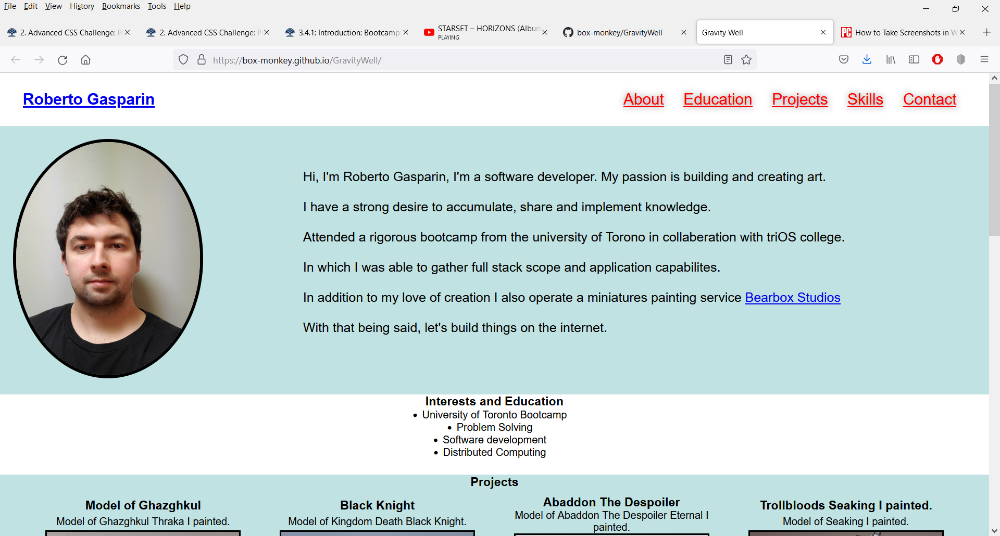
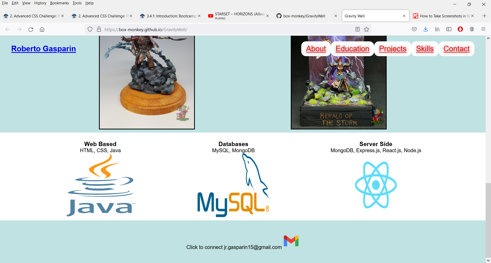
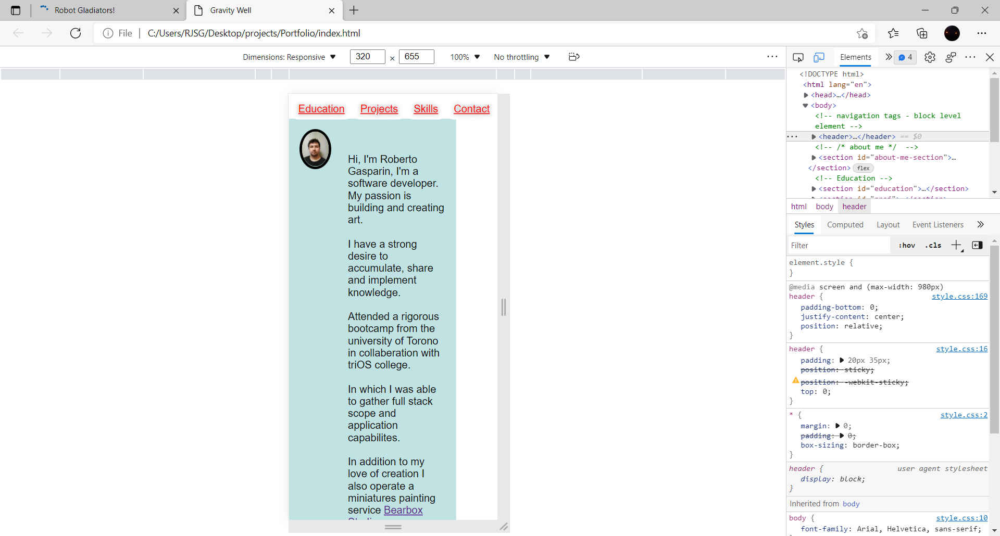
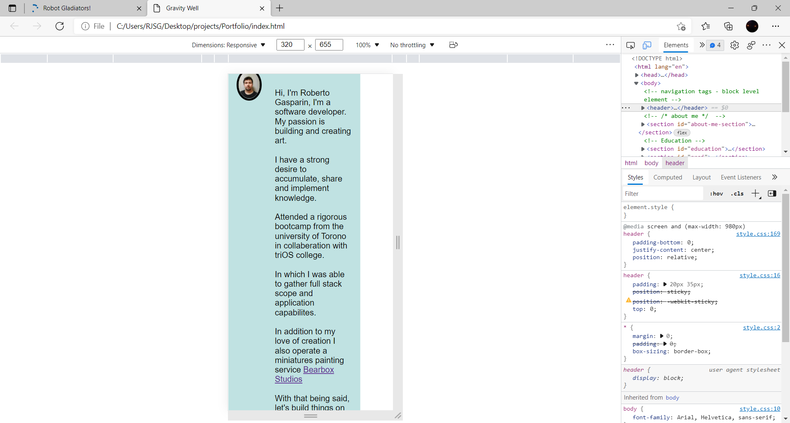

# What is gravity well
- portfolio challenge number 2, designed to be a responsive and interactive web page for client, decided to choose self as future portfolio practice. 

## running/published webpage
https://box-monkey.github.io/GravityWell/

### languages used
- HTML and CSS

#### responsive design
- as stated above, site optimized for regular screens, tablets and smaller screens such as phones.

##### projects
- I've added temporary work as placeholders to be removed/replaced from one of my side careers once computer based projects are completed.

###### screen shots 

